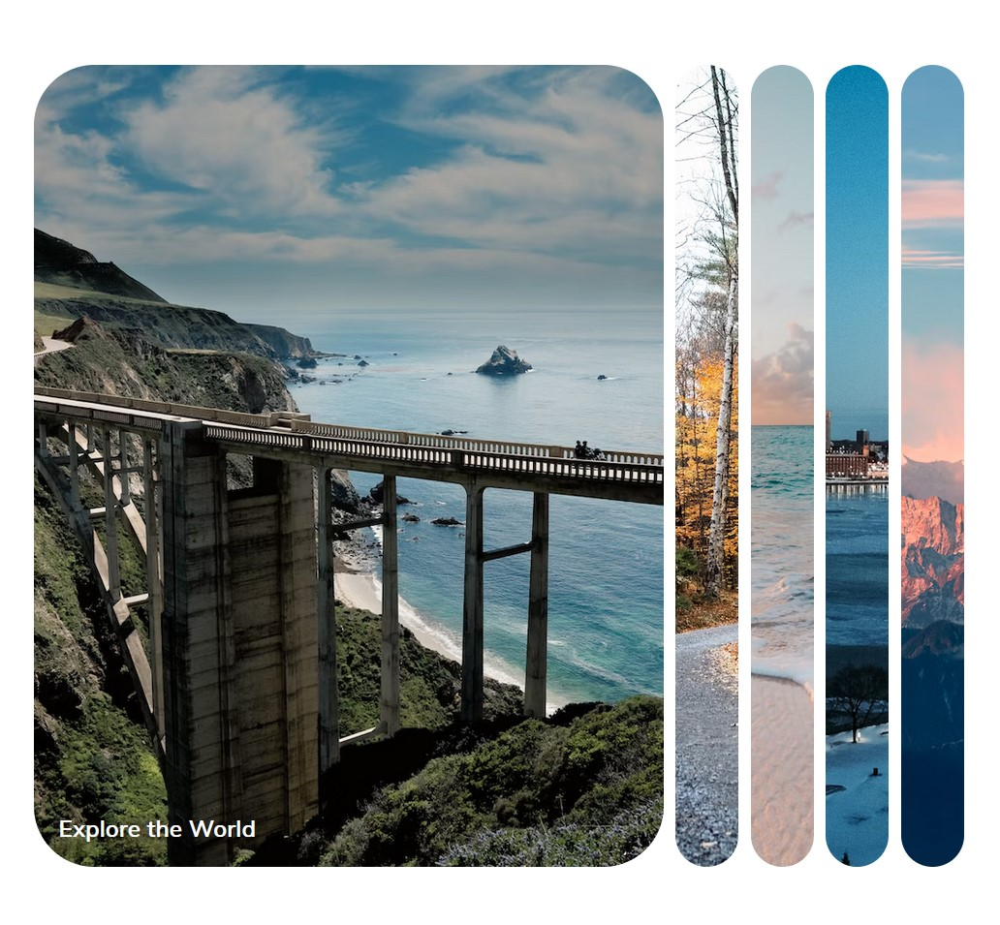

# 50 Projects in 50 Days - HTML/CSS and Javascript

This is project number 1 from the 50 Projects in 50 Days Course.

## Overview

This project's concept is a gallery of expanding cards.

Users should be able to:

- View the optimal layout for the section depending on their device's screen size
- Click on a panel to expand the picture

### Screenshot

## Resources

All resources were provided by the instructors.
